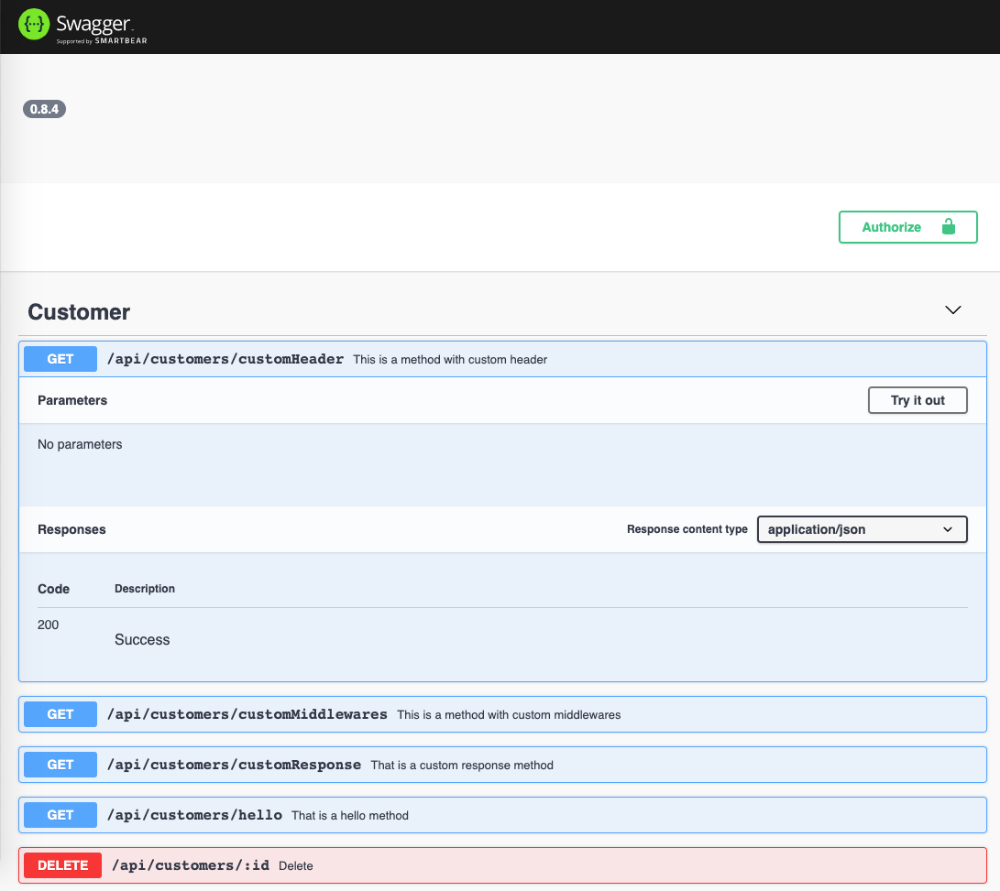

# Swagger UI

DaVinci ships with an integrated OpenAPI 2 specification generator
and [Swagger UI](https://swagger.io/tools/swagger-ui/), both are optional.

## Enable Swagger UI

To enable the OpenAPI json and the Swagger UI, pass the following options
to the `createApp` method of DaVinci.

```typescript{10,20}
import express, { Express } from 'express';
import { createApp, createRouter, DaVinciExpress } from '@davinci/core';
import { CustomerController } from './api/customer';
import packageJson = require('../package.json');

const options = {
	version: packageJson.version,
	openapi: {
		docs: {
			path: '/api-doc.json',
			options: {
				info: {
					title: 'Customer API',
					version: packageJson.version
				},
				securityDefinitions: { Bearer: { type: 'apiKey', name: 'Authorization', in: 'header' } }
			}
		},
		ui: {
			path: '/explorer'
		}
	}
};

const expressApp: Express = express();

createApp(expressApp, options, app => {
	app.use(createRouter({ Controller: CustomerController, resourceName: 'Customer' }));
});

if (require.main === module) {
	// this module was run directly from the command line as in node xxx.js
	(expressApp as DaVinciExpress).start();
}

export default expressApp;
```

<br/><br/>  
Now, point your browser to the `https?://{URL}/explorer` to consult the Swagger UI.


